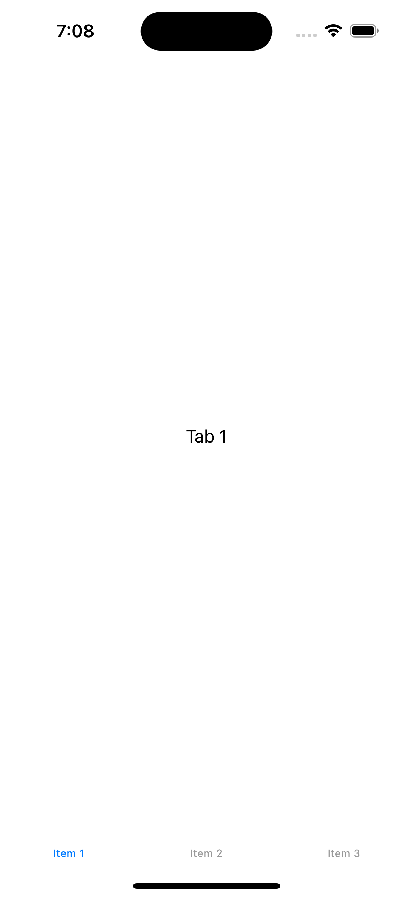

# SwiftUIでTabViewを使う

こちらの公式チュートリアル通りに進めて学習していく

https://developer.apple.com/tutorials/sample-apps/aboutme

[TavViewとは?](https://developer.apple.com/documentation/swiftui/tabview)

タブを使ったユーザーインターフェースを作成するには、TabViewにビューを配置し、各タブのコンテンツにtabItem(_:)モディファイアを適用します。iOSでは、badge(_:)のようなbadge修飾子を使用して、各タブにバッジを割り当てることもできます。

次の例では、3つのタブを持つタブビューを作成し、それぞれにカスタム子ビューを表示しています。最初のタブには数値バッジ、3番目のタブには文字列バッジがあります。

```swift
TabView {
    ReceivedView()
        .badge(2)
        .tabItem {
            Label("Received", systemImage: "tray.and.arrow.down.fill")
        }
    SentView()
        .tabItem {
            Label("Sent", systemImage: "tray.and.arrow.up.fill")
        }
    AccountView()
        .badge("!")
        .tabItem {
            Label("Account", systemImage: "person.crop.circle.fill")
        }
}
```

このように書けば簡単にタブメニューを作成できる。

```swift
//
//  ContentView.swift
//  LunchApp
//
//  Created by 橋本純一 on 2023/12/15.
//

import SwiftUI

struct ContentView: View {
    var body: some View {
        TabView {
            // --- ここから ---
            // タブ内に表示するビュー
            Text("Tab 1") // 実際には Text を使うのではなく、カスタムビューとなる
                .tabItem {
                    // タブのラベル部分のビュー
                    Text("Item 1")
                }
            // タブ内に表示するビュー
            Text("Tab 2") // 実際には Text を使うのではなく、カスタムビューとなる
                .tabItem {
                    // タブのラベル部分のビュー
                    Text("Item 2")
                }
            // タブ内に表示するビュー
            Text("Tab 3") // 実際には Text を使うのではなく、カスタムビューとなる
                .tabItem {
                    // タブのラベル部分のビュー
                    Text("Item 3")
                }

        }
    }
}

struct ContentView_Previews: PreviewProvider {
    static var previews: some View {
        ContentView()
    }
}
```

スクリーンショット


